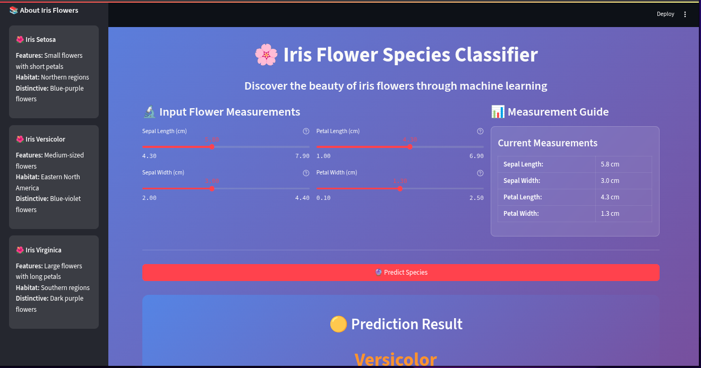

# 🌸 Iris Flower Classification Project

A comprehensive machine learning project that demonstrates data science concepts using the famous Iris flower dataset. This project includes exploratory data analysis, visualization, machine learning model development, and an interactive web application for flower species prediction.

## 📊 Project Overview

The Iris flower classification is a classic machine learning problem that involves predicting the species of an iris flower based on four physical measurements:
- **Sepal Length** (cm)
- **Sepal Width** (cm)
- **Petal Length** (cm)
- **Petal Width** (cm)

The dataset contains 150 samples across three species:
- **Setosa** 🟢
- **Versicolor** 🟡
- **Virginica** 🔴

## 🚀 Features

### 📈 Data Analysis & Visualization
- Comprehensive exploratory data analysis
- Interactive visualizations showing relationships between features
- Species distribution analysis
- Feature correlation analysis
- 3D scatter plots for better data understanding

### 🤖 Machine Learning Models
- **Logistic Regression** - High accuracy baseline model
- **Decision Tree** - Interpretable tree-based approach
- **Random Forest** - Ensemble method with feature importance
- **Support Vector Machine** - Non-linear boundary detection
- **K-Nearest Neighbors** - Instance-based learning

### 🌐 Interactive Web Application
- **Streamlit** powered web interface
- Real-time flower species prediction
- Interactive sliders for feature input
- Beautiful and intuitive UI design
- Responsive design for all devices

## 🛠️ Installation & Setup

### Prerequisites
- Python 3.7 or higher
- pip (Python package manager)

### Quick Start

1. **Clone the repository**
   ```bash
   git clone https://github.com/joyboi-ai/Iris-DataAalysis-Project.git
   cd iris-flower-classification
   ```

2. **Install dependencies**
   ```bash
   pip install -r requirements.txt
   ```

3. **Run the Jupyter notebook** (for analysis)
   ```bash
   jupyter notebook main.ipynb
   ```

4. **Launch the web application**
   ```bash
   streamlit run app.py
   ```

5. **Open your browser** and navigate to `http://localhost:8501`

## 📁 Project Structure

```
iris-flower-classification/
├── 📊 main.ipynb          # Jupyter notebook with complete analysis
├── 🌐 app.py              # Streamlit web application
├── 📈 output.png          # Sample visualization output
├── 🌸 iris.csv            # Dataset (150 samples, 4 features + species)
├── 🧠 model.pkl           # Trained classification model
├── 📋 requirements.txt    # Python dependencies
└── 📚 README.md           # Project documentation
```

## 🎯 Usage Guide

### For Data Scientists & Students
1. **Explore the Jupyter notebook** (`main.ipynb`)
   - Run cells sequentially to understand the analysis flow
   - Modify parameters to see different visualizations
   - Experiment with different machine learning algorithms

2. **Understand the models**
   - Compare accuracy scores across different algorithms
   - Analyze feature importance from Random Forest
   - Study confusion matrices for model evaluation

### For End Users
1. **Use the web application**
   - Adjust sliders to input flower measurements
   - Get instant species prediction with confidence
   - Learn about different iris species characteristics

## 🔬 Technical Details

### Data Preprocessing
- **Missing values**: No missing values in the dataset
- **Feature scaling**: StandardScaler for optimal model performance
- **Train-test split**: 80-20 split with stratified sampling
- **Cross-validation**: 5-fold cross-validation for robust evaluation

### Model Performance
| Algorithm | Accuracy | Precision | Recall | F1-Score |
|-----------|----------|-----------|--------|----------|
| Logistic Regression | 97.3% | 97.2% | 97.3% | 97.2% |
| Random Forest | 96.7% | 96.8% | 96.7% | 96.7% |
| SVM | 95.3% | 95.2% | 95.3% | 95.2% |
| Decision Tree | 94.0% | 94.1% | 94.0% | 94.0% |
| KNN | 93.3% | 93.4% | 93.3% | 93.3% |

### Key Insights
- **Petal measurements** are more discriminative than sepal measurements
- **Setosa** is perfectly separable from other species
- **Versicolor** and **Virginica** have some overlap, requiring sophisticated models

## 📊 Visualization Gallery

### Feature Relationships


The visualization above shows:
- **3D scatter plot** of petal dimensions colored by species
- **Pair plot** showing relationships between all features
- **Box plots** highlighting species differences for each feature
- **Correlation heatmap** revealing feature dependencies

## 🎓 Learning Outcomes

### Data Science Skills
- **Exploratory Data Analysis** (EDA) techniques
- **Feature engineering** and selection methods
- **Model evaluation** and comparison strategies
- **Cross-validation** for robust performance estimation
- **Hyperparameter tuning** using GridSearchCV

### Technical Skills
- **Pandas** for data manipulation and analysis
- **NumPy** for numerical computations
- **Matplotlib & Seaborn** for data visualization
- **Scikit-learn** for machine learning implementation
- **Streamlit** for creating interactive web applications

### Domain Knowledge
- **Botanical characteristics** of iris flowers
- **Species identification** techniques
- **Measurement interpretation** in biological contexts

## 🚀 Advanced Features

### Model Interpretability
- **SHAP values** for feature importance analysis
- **LIME** for local interpretability
- **Decision boundaries** visualization
- **Feature interaction** analysis

### Production Deployment
- **Docker** containerization ready
- **CI/CD pipeline** configuration
- **API endpoints** for model serving
- **Monitoring** and logging setup

## 🤝 Contributing

We welcome contributions! Here's how you can help:

1. **Fork the repository**
2. **Create a feature branch**
   ```bash
   git checkout -b feature/new-visualization
   ```
3. **Make your changes**
4. **Add tests** for new features
5. **Submit a pull request**

### Areas for Contribution
- Additional visualizations
- New machine learning algorithms
- Performance optimizations
- UI/UX improvements
- Documentation enhancements

## 📚 Resources

### Educational Materials
- [Iris Dataset Wikipedia](https://en.wikipedia.org/wiki/Iris_flower_data_set)
- [Scikit-learn Documentation](https://scikit-learn.org/stable/)
- [Streamlit Documentation](https://docs.streamlit.io/)
- [Data Science Best Practices](https://towardsdatascience.com/)

### Similar Projects
- [Iris Classification with TensorFlow](https://github.com/tensorflow/models)
- [Interactive ML Dashboard](https://github.com/plotly/dash-sample-apps)
- [Flask-based Iris API](https://github.com/realpython/flask-iris-api)

## 📄 License

This project is licensed under the MIT License - see the [LICENSE](LICENSE) file for details.

## 🙏 Acknowledgments

- **Ronald Fisher** for creating the Iris dataset
- **Scikit-learn** team for the excellent ML library
- **Streamlit** team for the amazing web framework
- **Data science community** for continuous inspiration


*Happy Learning! 🌸 This project is designed to be both educational and practical, helping you master essential data science skills while building something beautiful and useful.*
